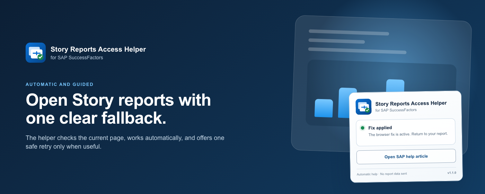
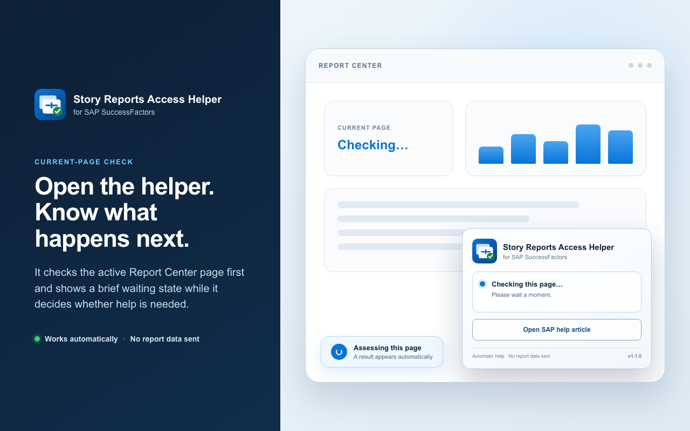
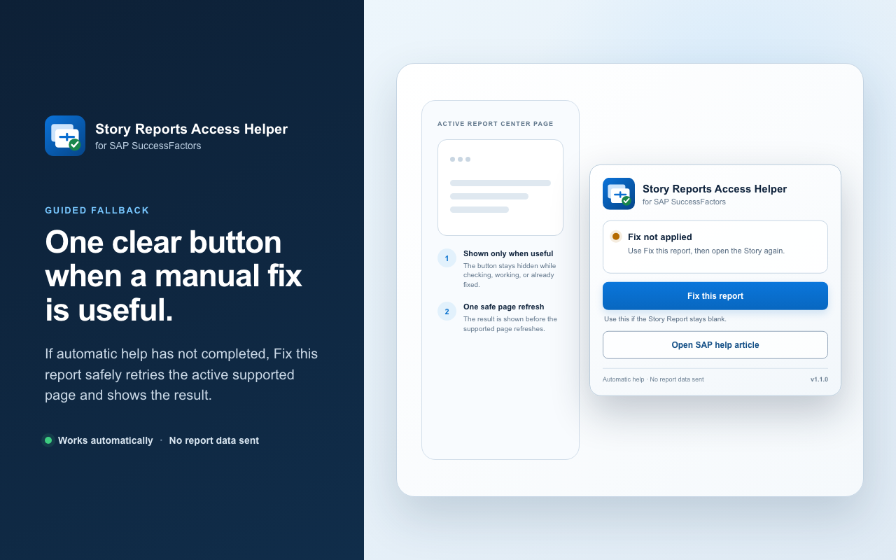
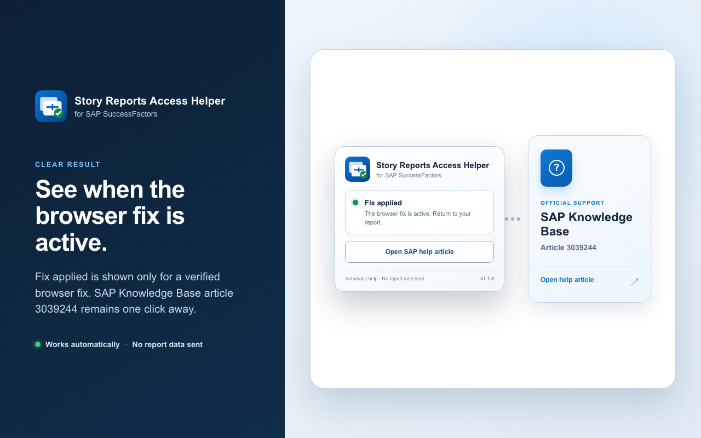
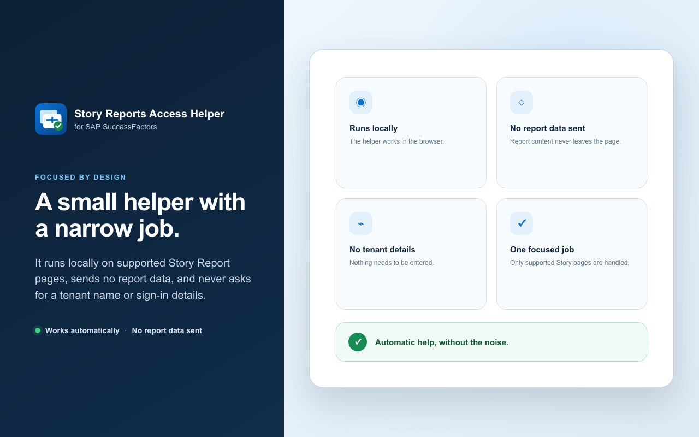

# Story Reports Access Helper for SAP

**Open supported SAP SuccessFactors Story Reports without the blank-page retry routine.**

Story Reports Access Helper prepares the narrow browser-storage access required by an SAP sign-in embedded in a Story Report. There is no tenant, company, account, or URL to configure.

<p align="center">
  <a href="https://microsoftedge.microsoft.com/addons/detail/bcmdpclnmpflaollgfjamioigkbpdmdc"></a>
</p>

Current source version: **v1.1.0**

[](docs/images/large-promo-1400x560.png)

## Story Reports, Without The Retry Dance

Some SAP SuccessFactors Story Reports can remain blank when Microsoft Edge prevents the embedded SAP Identity Authentication service from using its existing sign-in state. SAP describes this symptom in [KBA 3039244: Unable to access Story Reports due to Browser Settings](https://userapps.support.sap.com/sap/support/knowledge/en/3039244).

Story Reports Access Helper handles the compatible browser step automatically:

- **No setup:** install it once and open Story Reports normally.
- **Automatic recovery:** if Report Center was already open before installation or re-enablement, the extension prepares that exact active page with one normal refresh.
- **Manual fallback:** if SAP still stays blank, select **Fix this report** for one safe refresh of the active Report Center page.
- **Instance-aware:** the matching SAP Identity and SuccessFactors origins are derived from the live SAP frame context; no customer hostname is hardcoded.
- **Clear status:** the popup says whether no fix has been needed yet, the extension is working, the SAP page is prepared, or the browser fix was applied.
- **Built-in help:** one button opens the public preview of SAP KBA 3039244 in a new tab.
- **Local-first:** there is no telemetry, advertising, remote code, developer backend, or report-data collection.

## How To Use It

1. Install Story Reports Access Helper from Microsoft Edge Add-ons.
2. Open SAP SuccessFactors and select a Story Report as usual.
3. If the browser-storage issue is present, wait a few seconds while the extension prepares access.
4. If the Story stays blank, open the extension and select **Fix this report**, then open the Story again.
5. Use **Open SAP help article** for SAP's related troubleshooting guidance.

That is the complete end-user setup. The extension never asks for a tenant, company, account, password, MFA code, or report identifier.

## What Happens In The Browser

For an eligible SAP flow, the extension:

1. Detects SAP's exact storage-access page only when it is embedded in a supported SuccessFactors Story Report.
2. Derives the exact SAP Identity Authentication origin and matching SuccessFactors top-level origin from browser-provided frame context.
3. Creates and verifies a temporary cookie allowance for that exact pair only.
4. Revalidates the same SAP-owned document and lets its existing sign-in form continue at most once.
5. Removes extension-owned allowances automatically after a hard, non-renewing maximum of 60 minutes.

Microsoft Edge or enterprise policy can still prevent the setting from becoming effective. Expired SAP authentication, stricter tracking protection, missing authorization, and SAP-side changes remain authoritative. The extension stops rather than broadening access or entering a retry loop.

If Report Center predates installation or re-enablement, Microsoft Edge cannot retroactively add the extension's static content script to that existing document. The helper checks the active supported Report Center tab after installation, on a same-build service-worker start (including re-enablement), when the tab is activated, and when Microsoft Edge reports a matching URL change or page-load completion. If its current-build marker is absent, it performs one ordinary, cache-preserving refresh. It never refreshes an unrelated or background tab and never loops that automatic refresh.

The popup checks the current page when it opens. Its **Fix this report** action appears only when the current result can be retried, except that it remains available as a safe fallback if the availability check itself cannot complete. The service worker always revalidates the active supported Report Center page, refuses to interrupt an in-progress continuation, records the attempt before one normal refresh, shows the result before that refresh begins, and never clears browser cookies. A 30-second repeat guard prevents rapid repeated refreshes.

**Fix applied** means either that the exact temporary browser setting is currently verified as effective for this SuccessFactors site or that the extension durably recorded the local one-use continuation step for this tab. It does not mean that SAP authentication, authorization, network delivery, or Story rendering succeeded.

## Privacy And Security

The extension never reads cookie values, SAP form values, credentials, authentication payloads, report names, report identifiers, report content, employee data, or browsing history.

- Required browser permissions are limited to `storage`, `alarms`, and `contentSettings`.
- Required website access is limited to reviewed standard SAP Identity Authentication and SuccessFactors host families.
- `contentSettings` is used only for exact, temporary IAS-in-SuccessFactors cookie allowances.
- The SuccessFactors page marker is DOM-free and contains only the extension build/protocol version. A separate trusted-local marker stores only the current extension build so a same-build worker start can be distinguished from a version transition.
- Bounded local/session state contains browser identifiers, validated origins, timestamps, status codes, and opaque attempt identifiers only.
- Incognito/InPrivate execution is disabled.

Read the complete [privacy policy](PRIVACY.md), [security model](SECURITY.md), and [support guide](SUPPORT.md).

## Supported SAP-Hosted Instances

Tenant labels are discovered dynamically. The public Microsoft Edge build supports tenant subdomains under these reviewed standard host families.

SuccessFactors:

- `successfactors.com`
- `successfactors.eu`
- `successfactors.cn`
- `sapsf.com`
- `sapsf.eu`
- `sapsf.cn`
- `hr.cloud.sap`
- `sapcloud.cn`

SAP Identity Authentication:

- `accounts.ondemand.com`
- `accounts400.ondemand.com`
- `accounts.cloud.sap`
- `accounts400.cloud.sap`
- `accounts.sapcloud.cn`

Coverage is based on these reviewed host-family patterns; it is not a claim that every tenant in every family has been live-tested.

Customer-configured IAS custom hostnames are not silently trusted. Supporting an arbitrary hostname safely would require a separately validated exact allowlist or enterprise policy; this public build deliberately avoids broad access to every website.

## See It In Action

Click an image to view it at full size.

| Automatic recovery | Clear status |
| --- | --- |
| [](docs/images/screenshot-01-automatic-fix-1280x800.png) | [](docs/images/screenshot-02-simple-status-1280x800.png) |
| An active Report Center page that predates installation is refreshed once. | Users see whether the browser fix has run, plus one manual fallback. |

| SAP guidance | Local-first design |
| --- | --- |
| [](docs/images/screenshot-03-built-in-help-1280x800.png) | [](docs/images/screenshot-04-private-by-design-1280x800.png) |
| Open SAP's public troubleshooting article directly from the popup. | No report data, cookie values, credentials, or telemetry are collected. |

## Technical Reference

Most users only need the Microsoft Edge Add-ons installation. The sections below cover source verification and release engineering.

### Build And Verify

Node.js 20 or later is required. The project has no runtime or development dependencies.

```bash
npm ci
npm run verify
npm run package:edge
npm run verify:edge-package
```

The Microsoft Edge Add-ons artifact is written to:

```text
release/story-reports-access-helper-for-sap-vX.Y.Z-microsoft-edge-addons.zip
```

The package loaded for acceptance testing and the package uploaded to Microsoft must be byte-for-byte identical. See the [release runbook](docs/RELEASE.md) and [validation record](docs/VALIDATION.md).

Store artwork is already tracked. Maintainers who need to regenerate it can install the pinned renderer without changing the lockfile, then run the asset task:

```bash
npm install --no-save --package-lock=false playwright@1.62.1
npm run assets:edge
```

### Repository Layout

- `src/`: service worker, SAP frame scripts, popup, and local state logic.
- `tests/`: lifecycle, security-boundary, popup, packaging, and publisher tests.
- `icons/`: packaged extension icons.
- `store/assets/`: Microsoft Edge Add-ons listing artwork.
- `docs/images/`: public README copies of the Store artwork.
- `release/`: ignored locally generated Microsoft Edge package and checksum.

## Support

Start with [SUPPORT.md](SUPPORT.md) or open a sanitized public issue at the [GitHub issue tracker](https://github.com/RobinMJD/Story-Reports-Access-Helper-for-SAP/issues). Never attach a raw HAR, cookies, authentication payloads, report content, employee information, credentials, or a screenshot containing customer data.

## Independent Project

Story Reports Access Helper is an independent compatibility helper. It is not an SAP product and is not affiliated with, sponsored by, or endorsed by SAP or Microsoft. SAP, SAP SuccessFactors, and related marks belong to their respective owners.

## License

Released under the [MIT License](LICENSE).

## References

- [SAP KBA 3039244: Unable to access Story Reports due to Browser Settings](https://userapps.support.sap.com/sap/support/knowledge/en/3039244)
- [SAP Storage Access API guidance](https://help.sap.com/docs/btp/implementing-permanent-solution-for-third-party-cookie-deprecation-final/storage-access-api-saa?version=Cloud)
- [SAP SuccessFactors Common Super Domain URL changes](https://help.sap.com/docs/successfactors-platform/implementing-common-super-domain/e78cc7b3bc644f15bfc7b051e19c237a.html)
- [SAP Identity Authentication custom domains](https://help.sap.com/docs/cloud-identity-services/cloud-identity-services/use-custom-domain-in-identity-authentication)
- [Microsoft Edge Add-ons developer policies](https://learn.microsoft.com/en-us/legal/microsoft-edge/extensions/developer-policies)
